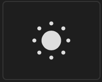
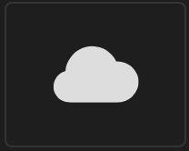
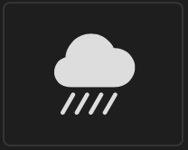
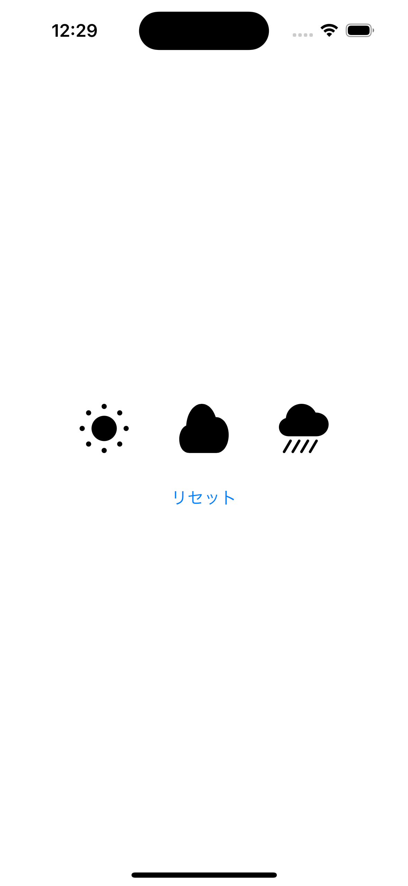
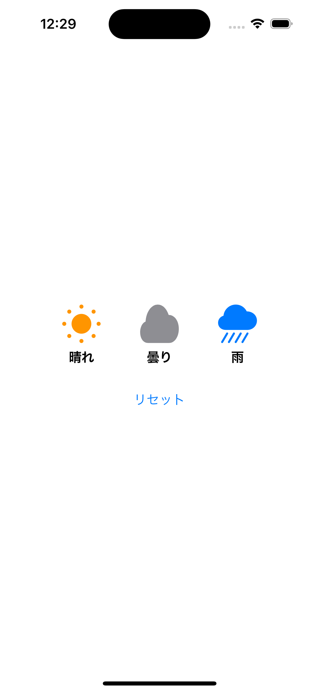

# 課題1

## 課題内容

天気に関連した画像のボタンを配置します。

ボタンをタップした際には関連した色に変更し、文字を表示してください。

また、リセットボタンを配置し、タップした際には元に戻せるようにしてください。

## 仕様情報

* 画像ボタン情報(Image(systemName:))
  * 初期表示の色 → 黒色
  * サイズ 48px × 48px
  * ボタン間隔 48px

sun.min.fill | cloud.fill | cloud.heavyrain.fill
:--: | :--: | :--:
 |  | 

* 画像のボタンをタップした際の処理
  * sun.min.fill → 画像をオレンジ色に変更し、晴れの文字を表示
  * cloud.fill → 画像を灰色に変更し、曇りの文字を表示
  * cloud.heavyrain.fill → 画像を青色に変更し、雨の文字を表示

* 画像のボタンをタップした際に表示する文字情報
  * 文字サイズ → .headline

* リセットボタンをタップした際の処理
  * 全ての色を元に戻す
  * 表示された文字を全て消す

## 想定画面

初期画面 | ボタンタップ時
:--: | :--:
 | 