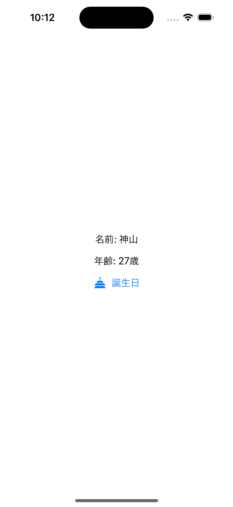

# 課題2

## 課題内容

プロフィールの情報(名前、年齢)を管理するクラスを作成し、情報を画面に表示できるようにします。

また、誕生日ボタンを設置し、タップした際に表示されている年齢を1つ増やすようにしてください。

## 仕様情報

* プロフィール情報を管理するクラス
  * クラス名
    * Profile
  * 定義するプロパティ名
    * name「自身の名前を保持」
    * age「自身の年齢を保持」
  * 定義する関数名
    * happyBirthday

* 誕生日ボタン
  * ボタンテキスト
    * 誕生日
  * ボタン画像
    * 「systemName: birthday.cake.fill」
  * タップした際の処理
    * 年齢を1つ増やして表示

## 想定画面

初期画面 | 誕生日ボタンタップ後
:--: | :--:
 | 