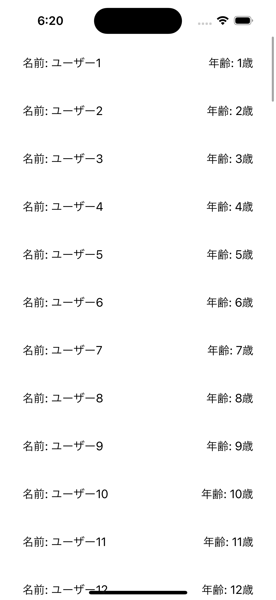
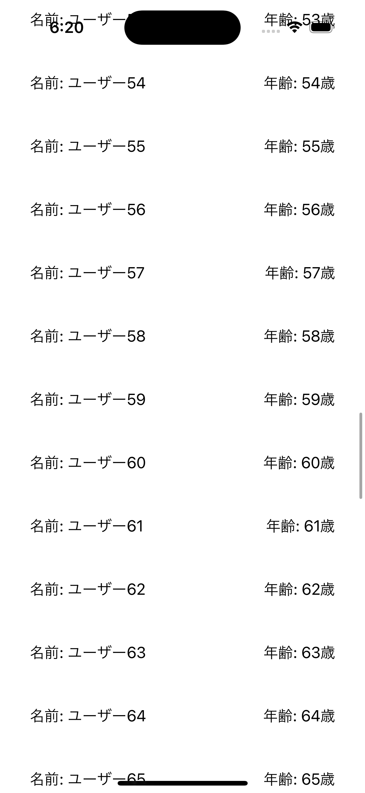
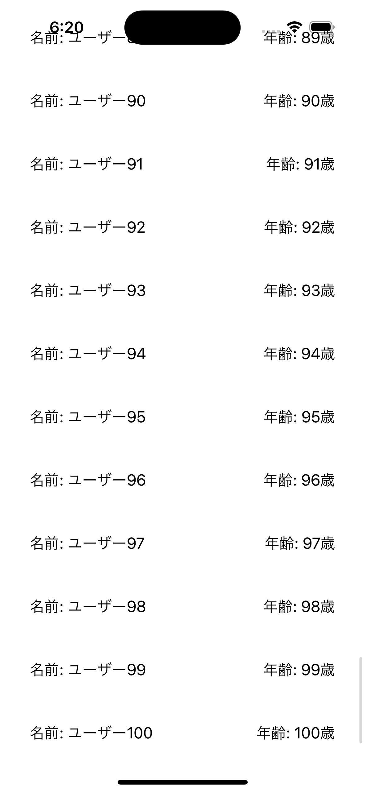

# 課題3

## 課題内容

プロフィールの情報(名前、年齢)を管理する構造体を作成し、情報を画面に表示できるようにします。

適当なユーザーを100人作成し、スクロール可能なViewで表示するようにしてください。

## 仕様情報

* プロフィール情報を管理する構造体
  * 構造体名
    * Profile
  * 定義するプロパティ名
    * name
    * age

* 表示するユーザー情報
  * 名前
    * ユーザー1, ユーザー2, ユーザー3, ... ユーザー100
  * 年齢
    * 1, 2, 3, 4, 5, ... 100

* 表示するView情報
  * 定義するプロパティ名
    * users(表示する100人分のユーザー情報を保持)
  * 名前、年齢を表示する情報
    * 高さ 60px
    * 余白 左右の端から32px空ける

## 想定画面

初期画面 | 途中 | 最終スクロール
:--: | :--: | :--:
 |  | 