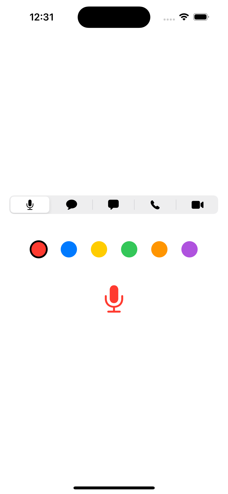
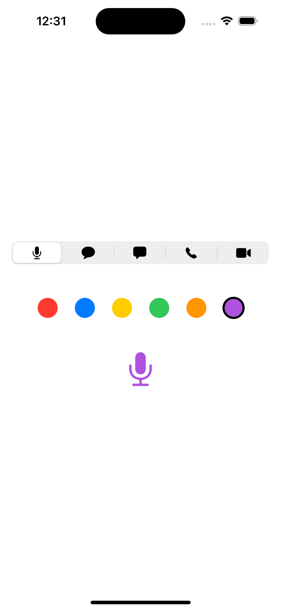
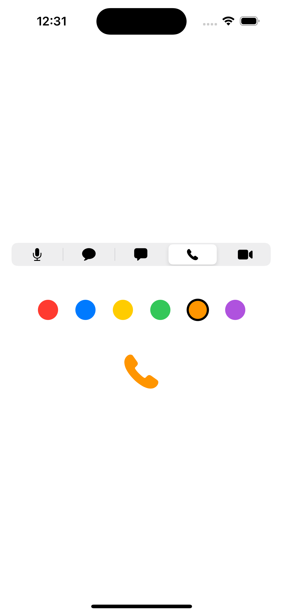

# 課題4

## 課題内容

アイコンと色をそれぞれ選択できるViewを作成し、選択したアイコン、色に沿った画像を画面に表示できるようにします。

選択しているアイコン、色は選択されていることが分かるように表示してください。

## 仕様情報

* 表示する選択アイコン情報
  * systemName
    * マイク:「mic.fill」
    * メッセージ:「message.fill」
    * 吹き出し:「bubble.fill」
    * 携帯:「phone.fill」
    * 動画:「video.fill」
  * 初期表示アイコン → マイク:「mic.fill」

* 表示する選択色情報
  * 赤、青、黄、緑、橙、紫
  * 初期表示色 → 赤
  * 色サイズ → 28px × 28px
  * 色間隔 → 24px
  * 選択された色 → 3pxの黒色で囲む

* 表示するアイコン情報
  * サイズ → 48px × 48px
  * 色 → 選択されている色

* 表示するView情報
  * 選択アイコン表示 → Pickerで表示
  * 選択色表示 → ボタンで表示
  * 各View間隔 → 48px

## 想定画面

初期画面 | 選択1 | 選択2
:--: | :--: | :--:
 |  | 