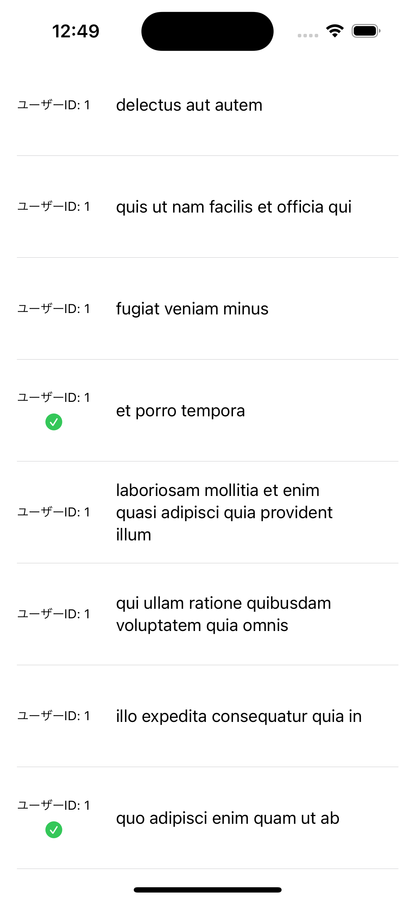
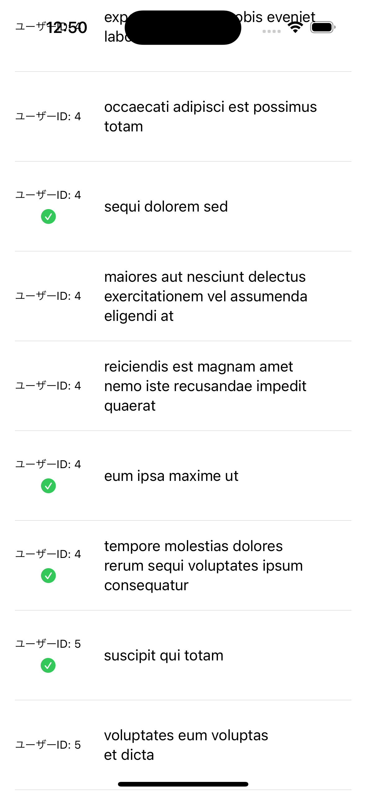
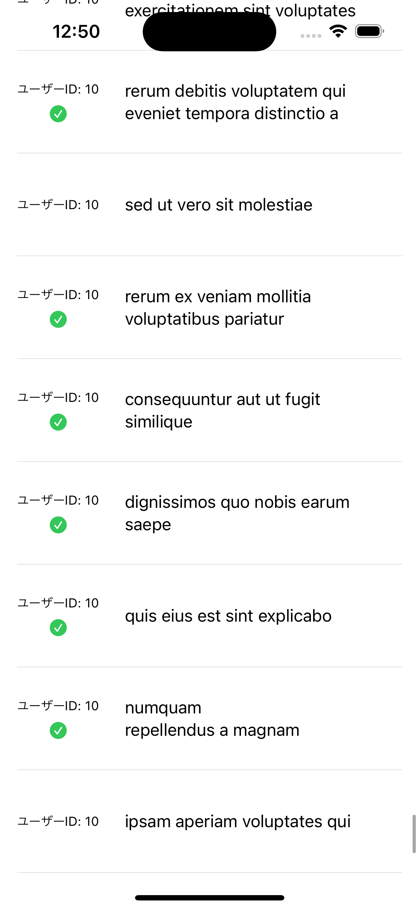

# 課題5

## 課題内容

API通信を行い、受け取った結果を画面に表示できるようにします。

受け取れる結果はTodo要素となっているため、ViewにユーザーID、タイトル、タスクが完了しているかを表示してください。

タスクが完了している場合は、チェックマークを表示します。

## 仕様情報

* API通信を行うための処理
  * 受け取った結果をSwift上でデータ表現できるようにデータ構造体を作成する
  * 受け取った結果をViewに表示するためのデータを保持する
  * `???`に処理を追加する

``` swift
// TODO: 受け取った結果をSwift上でデータ表現できるようにデータ構造体を作成する

final class APIClient: ObservableObject {
    // TODO: 受け取った結果をViewに表示するためのデータを保持する
    // TODO: `???`に処理を追加する

    func request() async {
        guard let url = URL(string: "https://jsonplaceholder.typicode.com/todos") else {
            return
        }

        do {
            let (data, _) = try await URLSession.shared.data(from: url)
            let ??? = try JSONDecoder().decode(???, from: data)
            Task { @MainActor in
                ???
            }
        } catch {
            print(error.localizedDescription)
        }
    }
}
```

* APIで受け取るTodoの情報
  * [API情報](https://jsonplaceholder.typicode.com/)
  * [APIで受け取るTodoの情報](https://jsonplaceholder.typicode.com/todos)
    * id
    * userId
    * title
    * completed

* 表示するTodo情報
  * ユーザーID
    * APIから受け取ったuserId
    * 文字サイズ → caption
  * タイトル
    * APIから受け取ったtitle
    * 文字サイズ → callout
  * 完了済タスク
    * systemName: 「checkmark.circle.fill」
    * 画像サイズ → 16px × 16px
    * 画像色 → 緑
  * 各View間隔 → 24px
  * ユーザーIDと完了済みタスク間隔 → 8px
  * 高さ 80px

* 表示するView情報
  * Todoの表示 → スクロールできるように表示
  * 左右の空いている余白 → 16px

## 想定画面

初期画面 | 途中 | 最終スクロール
:--: | :--: | :--:
 |  | 