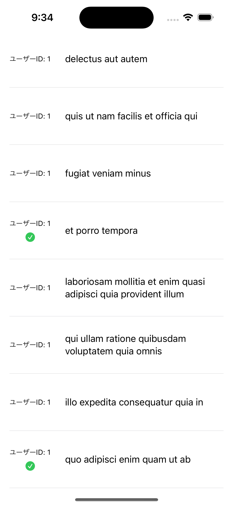
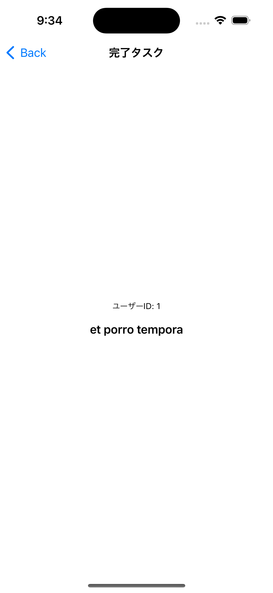
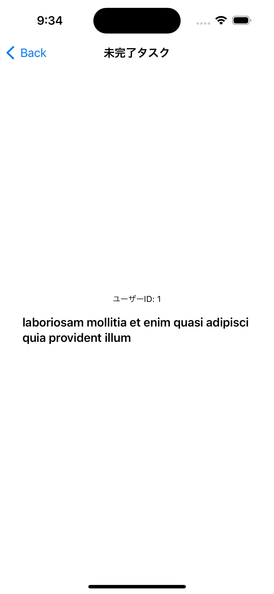

# 課題6

## 課題内容

課題5で作成したViewの1つの列(アイテム)をタップした際に、その情報を持った別のViewに遷移できるようにします。

遷移先ではユーザーID、タイトルをViewに表示し、ナビゲーション部分のタイトルにはタスクが完了している場合は「完了タスク」、完了していない場合は「未完了タスク」と表示するようにしてください。

## 仕様情報

* 遷移するViewの情報
  * ユーザーID
    * 文字サイズ → caption
  * タイトル
    * 文字サイズ → headline
  * タイトル
    * タスク完了の状態 → 「完了タスク」
    * タスク未完了の状態 → 「未完了タスク」
  * 各View間隔 → 16px
  * 左右の空いている余白 → 16px

## 想定画面

初期画面 | 遷移(完了タスク) | 遷移(未完了タスク)
:--: | :--: | :--:
 |  | 